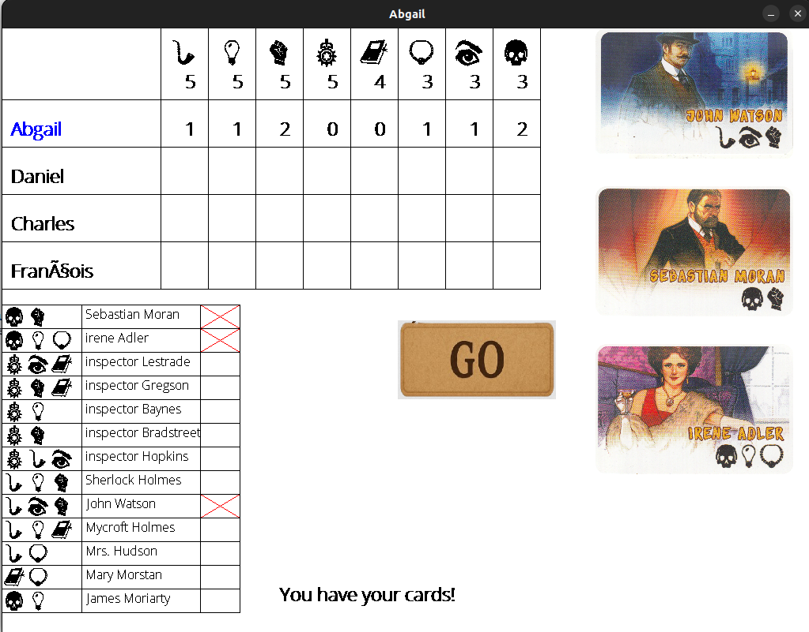
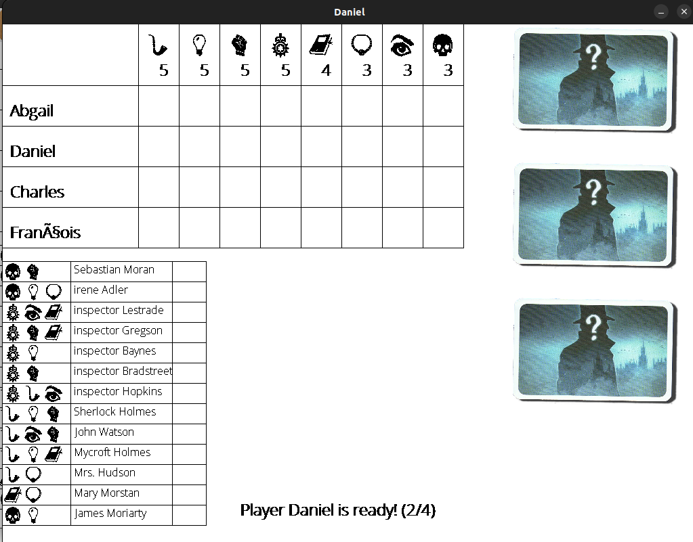
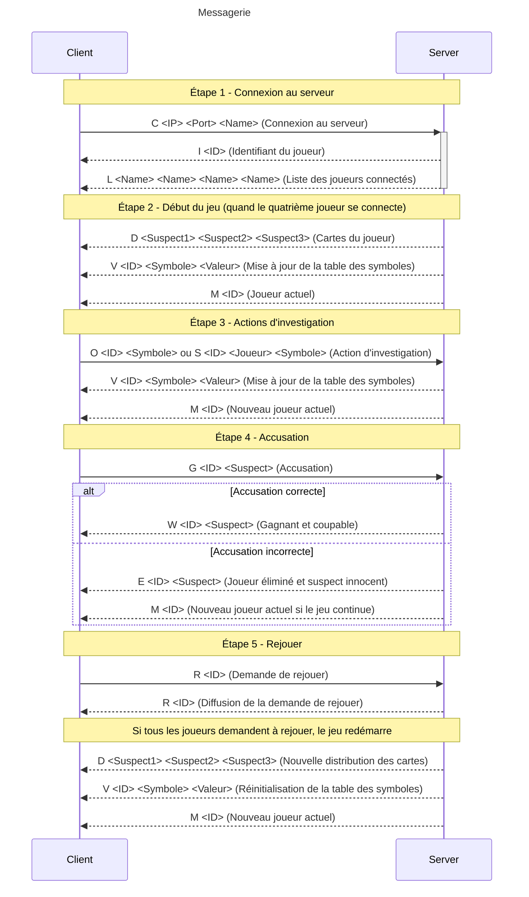

# 🕵️‍♂️ Sherlock 13 - Implémentation en C pour 4 Joueurs online

Bienvenue dans l'implémentation du jeu **Sherlock 13** en langage C, conçu pour 4 joueurs. Ce projet recrée l'expérience du jeu de société en mettant l'accent sur la logique et la déduction.

## Fonctionnement Technique

Ce projet utilise un serveur écrit en C pour gérer les interactions entre les joueurs. Le fonctionnement est orchestré via websockets et utilise des threads, permettant une gestion simultanée des actions de chaque joueur. Pour plus de détails techniques, consultez le [rapport](doc/rapport.pdf).

---

## Installation

Pour installer et exécuter le projet, suivez les étapes ci-dessous :

1. Clonez le dépôt GitHub :

    ```bash
    git clone https://github.com/dan-lara/Sherlock-13-Game.git
    cd Sherlock-13-Game
    ```

2. Construisez le projet avec `make` :

    ```bash
    make all
    ```

3. Lancez le jeu (serveur et client) :

    ```bash
    make run_server 30000
    # ou ./build/server 
    ```

    Chaque client doit être dans un terminal distinct.

    ```bash
    ./build/client localhost 30000 localhost 40000 Abgail
    ./build/client localhost 30000 localhost 40001 Bernard
    ./build/client localhost 30000 localhost 40002 Charles
    ./build/client localhost 30000 localhost 40003 Daniel

    ```

4. Nettoyez les fichiers de construction si nécessaire :

    ```bash
    make clean
    ```

## Démonstration

Ajoutez ici une capture d'écran ou une photo montrant le jeu en action :




---

## Architecture

Voici un schéma de l'architecture du projet pour mieux comprendre son organisation :



## Règles du Jeu

Le jeu suit les règles classiques de **Sherlock 13**. Chaque joueur doit utiliser la logique et poser des questions pour identifier le coupable parmi les suspects. Vous pouvez consulter les règles complètes [ici](doc/regle.pdf).

---

## Contribuer

Les contributions sont les bienvenues ! N'hésitez pas à ouvrir une issue ou soumettre une pull request.
