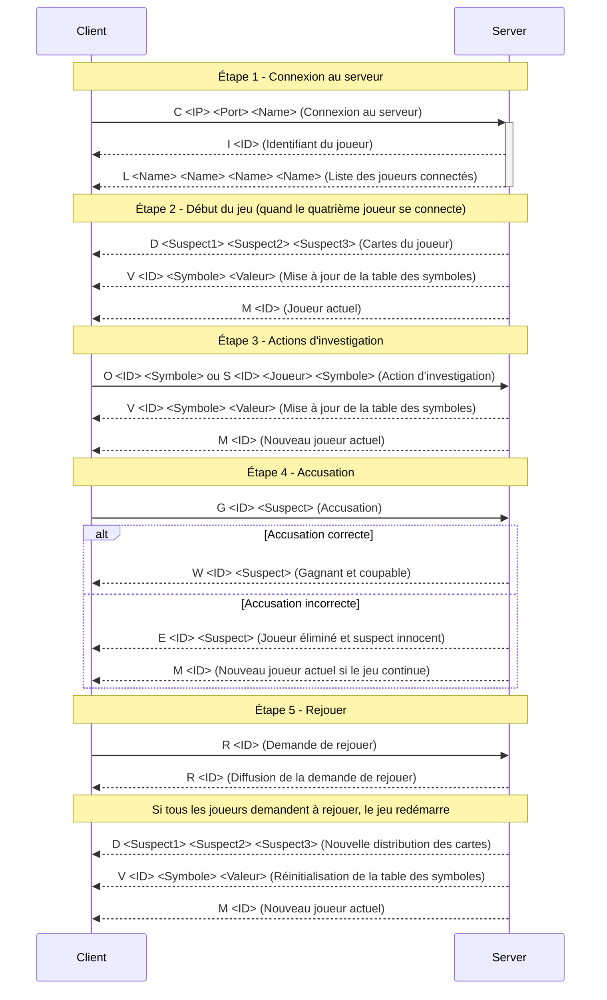

# Description de l'architecture

## Messagerie

```mermaid
sequenceDiagram
    participant Client
    participant Server

    %% Connexion
    Note over Client,Server: Étape 1 - Connexion au serveur
    Client->>+Server: C <IP> <Port> <Name> (Connexion au serveur)
    Server-->>Client: I <ID> (Identifiant du joueur)
    Server-->>-Client: L <Name> <Name> <Name> <Name> (Liste des joueurs connectés)

    %% Début du jeu
    Note over Client,Server: Étape 2 - Début du jeu (quand le quatrième joueur se connecte)
    Server-->>Client: D <Suspect1> <Suspect2> <Suspect3> (Cartes du joueur)
    Server-->>Client: V <ID> <Symbole> <Valeur> (Mise à jour de la table des symboles)
    Server-->>Client: M <ID> (Joueur actuel)

    %% Actions d'investigation
    Note over Client,Server: Étape 3 - Actions d'investigation
    Client->>Server: O <ID> <Symbole> ou S <ID> <Joueur> <Symbole> (Action d'investigation)
    Server-->>Client: V <ID> <Symbole> <Valeur> (Mise à jour de la table des symboles)
    Server-->>Client: M <ID> (Nouveau joueur actuel)

    %% Accusation
    Note over Client,Server: Étape 4 - Accusation
    Client->>Server: G <ID> <Suspect> (Accusation)
    alt Accusation correcte
        Server-->>Client: W <ID> <Suspect> (Gagnant et coupable)
    else Accusation incorrecte
        Server-->>Client: E <ID> <Suspect> (Joueur éliminé et suspect innocent)
        Server-->>Client: M <ID> (Nouveau joueur actuel si le jeu continue)
    end

    %% Rejouer
    Note over Client,Server: Étape 5 - Rejouer
    Client->>Server: R <ID> (Demande de rejouer)
    Server-->>Client: R <ID> (Diffusion de la demande de rejouer)
    Note over Client,Server: Si tous les joueurs demandent à rejouer, le jeu redémarre
    Server-->>Client: D <Suspect1> <Suspect2> <Suspect3> (Nouvelle distribution des cartes)
    Server-->>Client: V <ID> <Symbole> <Valeur> (Réinitialisation de la table des symboles)
    Server-->>Client: M <ID> (Nouveau joueur actuel)
```
